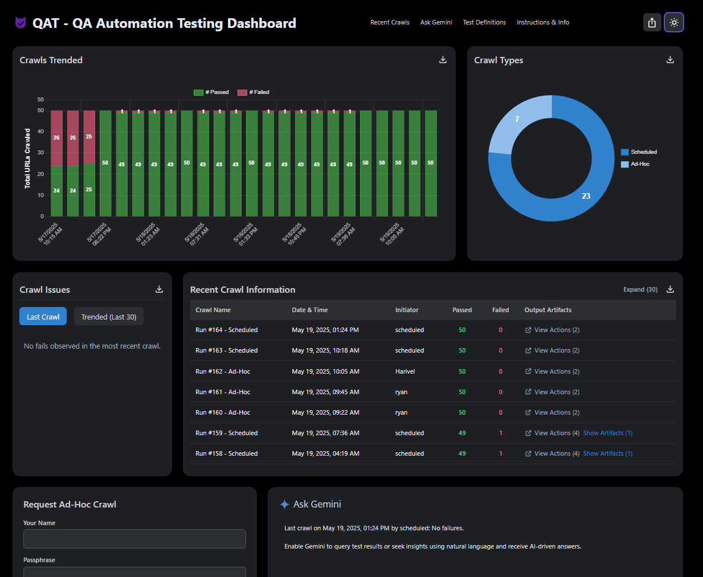

# QA Automation Tool

A centralized platform for automating web-application quality assurance.
Runs a predefined suite of end-to-end checks, aggregates results in real time, and presents trends on a clean dashboard.

[Live Dashboard →](https://qa-automation-tool.vercel.app/)

---

## Status & CI

- **Scheduled tests**: every 3 hours via GitHub Actions  
- **Cleanup tasks**: every 3 days (Supabase & Vercel KV)  
- **Coverage**:  
  - Playwright tests for page structure, functionality and performance  
  - Manual-mode support via Excel input

  

---

## Overview

The QA Automation Tool:

- **Executes** a comprehensive set of UI and workflow checks across target URLs  
- **Stores** results, progress and artifacts (screenshots, videos when needed) in Supabase and Vercel KV  
- **Visualizes** outcomes and trends in an interactive Next.js dashboard  
- **Enables** ad-hoc and scheduled runs, with AI-driven query support via Gemini  

---

## Technology Stack

| Layer         | Framework / Service                    |
|---------------|----------------------------------------|
| Application   | Node.js, Next.js                       |
| Automation    | Playwright                             |
| Data Storage  | Supabase (Postgres) & Vercel KV        |
| CI / Delivery | GitHub Actions, Vercel                 |
| Reporting     | Chart.js, ExcelJS                      |
| AI Insights   | Gemini with LangChain                  |

---

## Key Features

### Dashboard

- **Recent Runs**: pass/fail/N-A counts, trend charts, artifact links  
- **Ask Gemini**: natural-language queries (passphrase-protected)  
- **Ad-hoc Execution**: submit name, passphrase, optional Excel; trigger tests immediately  

### Scheduling & Cleanup

- **Run QA**: every 3 hours (cron)  
- **Cleanup**: Supabase & KV data older than 60 days, every 3 days  

### Manual Validation

- **Screaming Frog** tab outlines steps to replicate tests manually (requires paid license)  

---

## Test Definitions & Protocol

| ID      | Name                        | Description                                          |
|---------|-----------------------------|------------------------------------------------------|
| **TC-01** | Hero Overlay on Desktop    | Hero text visible at 1920×1080 for homepage, category, product and custom hero banners |
| **TC-02** | Hero Static on Mobile      | Hero text visible on 375×667 viewport                |
| **TC-03** | Header Presence            | `<header>` or class containing “header”              |
| **TC-04** | Navigation Presence        | `<nav>` or class containing “nav”                    |
| **TC-05** | Main Content               | `<main>` or class containing “main”                  |
| **TC-06** | Footer Presence            | `<footer>` or class containing “footer”              |
| **TC-07** | Main Video & Carousel      | `<video>` or Vidyard iframe; play button opens modal; carousel videos show no "Video Not Found" |
| **TC-08** | Contact Form Opens         | “Contact” button launches form overlay               |
| **TC-09** | Rendering Error Check      | No “A rendering error occurred” text                 |
| **TC-10** | Gatekeeper Redirect        | Incognito + “Yes” click yields 200 status            |
| **TC-11** | Insights Link Works        | First insights/newsroom link returns HTTP 200        |
| **TC-12** | DocCheck Login Route       | Incognito → URL includes `/account/doccheck-login`   |
| **TC-13** | DE Nav Redirect            | “Produkte → Ultraschall → Mehr erfahren” → target site |
| **TC-14** | HTTP Status Code Valid     | Status 200 or valid redirect (301/302)               |

Supported hero components for **TC-01**:
- `.ge-homepage-hero-v2-component`
- `.ge-category-hero__container`
- `.hero-content-intro`
- `.product-heroV2-container`

For details and any custom extraction, use the dashboard’s **Test Definitions** section.

---

## Internal Use & Contact

This repository is public for transparency but intended **only** for internal use.  
For assistance, please reach out via company channels (Teams/Outlook).

---

## License

All rights reserved © Ryan Smedstad.  
Unauthorized copying, modification or distribution is prohibited.
